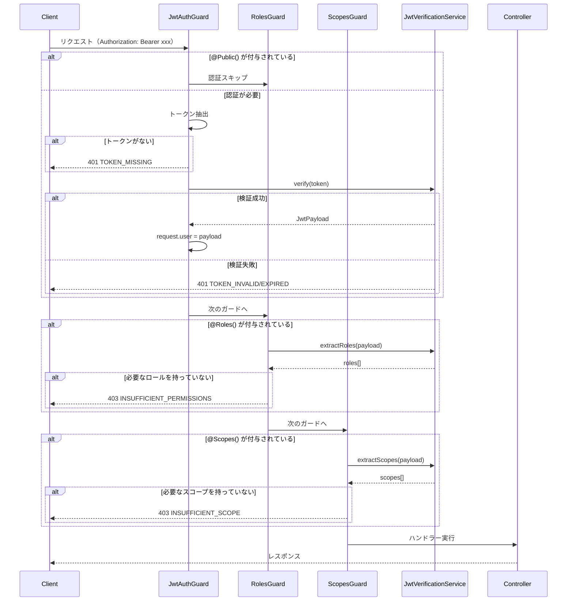

# 認証モジュール内部設計

このドキュメントでは、`src/auth` ディレクトリの認証モジュールの内部実装について詳細に解説します。

> **Note**: 使い方ガイドについては [authentication.md](./authentication.md) を参照してください。

## 概要

認証モジュールは、JWTベースの認証・認可機能を提供します。以下の機能を担当します:

- JWTトークンの検証（JWKS / 対称鍵）
- ロールベースアクセス制御（RBAC）
- スコープベースアクセス制御
- 公開エンドポイントの指定

## ファイル構成と責務

```
src/auth/
├── auth.module.ts                    # DIコンテナ設定、グローバルガード登録
├── decorators/
│   ├── public.decorator.ts           # @Public() - 認証スキップ
│   ├── current-user.decorator.ts     # @CurrentUser() - ユーザー情報取得
│   ├── roles.decorator.ts            # @Roles() - ロール指定
│   └── scopes.decorator.ts           # @Scopes() - スコープ指定
├── guards/
│   ├── jwt-auth.guard.ts             # JWT検証ガード（認証）
│   ├── roles.guard.ts                # ロール認可ガード
│   └── scopes.guard.ts               # スコープ認可ガード
├── services/
│   └── jwt-verification.service.ts   # JWT検証ロジック
└── interfaces/
    ├── jwt-payload.interface.ts      # JWTペイロード型定義
    └── auth-config.interface.ts      # 認証設定型定義
```

### 依存関係

```
AuthModule
    │
    ├── JwtAuthGuard ──────► JwtVerificationService
    │       │
    │       └── IS_PUBLIC_KEY (メタデータ)
    │
    ├── RolesGuard ────────► JwtVerificationService
    │       │
    │       └── ROLES_KEY (メタデータ)
    │
    └── ScopesGuard ───────► JwtVerificationService
            │
            └── SCOPES_KEY (メタデータ)
```

## 認証フロー詳細

### シーケンス図



### 1. JwtAuthGuard - トークン検証

JwtAuthGuardは、すべてのリクエストに対して最初に実行されるグローバルガードです。

**処理フロー:**

1. **@Public() チェック**: Reflectorを使用して、ハンドラーまたはコントローラーに `IS_PUBLIC_KEY` メタデータが設定されているかを確認
2. **トークン抽出**: `Authorization: Bearer {token}` ヘッダーからトークンを抽出
3. **トークン検証**: JwtVerificationServiceで署名を検証
4. **ペイロード格納**: 検証済みペイロードを `request.user` に格納

```typescript
// メタデータの優先順位
// 1. メソッドレベル (@Public() on handler)
// 2. クラスレベル (@Public() on controller)
const isPublic = this.reflector.getAllAndOverride<boolean>(IS_PUBLIC_KEY, [
  context.getHandler(), // メソッドを優先
  context.getClass(),   // クラスにフォールバック
]);
```

### 2. RolesGuard - ロール認可

RolesGuardは、ロールベースのアクセス制御を行います。

**処理フロー:**

1. `@Roles()` デコレーターから必要なロールを取得
2. ロールが指定されていない場合はパス
3. `request.user` からユーザー情報を取得
4. JwtVerificationServiceでロールを抽出
5. 必要なロールのいずれかを持っているかチェック（**OR条件**）

```typescript
// OR条件での評価
// ['admin', 'moderator'] が指定されている場合、
// ユーザーが 'admin' または 'moderator' のいずれかを持っていればOK
const hasRole = requiredRoles.some((role) => userRoles.includes(role));
```

### 3. ScopesGuard - スコープ認可

ScopesGuardは、OAuth 2.0スタイルのスコープベースアクセス制御を行います。

**処理フロー:**

1. `@Scopes()` デコレーターから必要なスコープを取得
2. スコープが指定されていない場合はパス
3. `request.user` からユーザー情報を取得
4. JwtVerificationServiceでスコープを抽出
5. ワイルドカードマッチングを含むスコープ検証（**OR条件**）

## JwtVerificationService実装詳細

### 検証方式の自動選択（JWKS vs 対称鍵）

JwtVerificationServiceは、環境変数の設定に基づいて検証方式を自動選択します。

```
JWT_JWKS_URI が設定されている場合
    └── JWKS（公開鍵）検証を使用
    └── 署名アルゴリズム: RS256, RS384, RS512, ES256, ES384, ES512

JWT_SECRET のみ設定されている場合
    └── 対称鍵検証を使用
    └── 署名アルゴリズム: HS256, HS384, HS512

どちらも設定されていない場合
    └── UnauthorizedException をスロー
```

**JWKS検証の特徴:**

- 公開鍵はJWKSエンドポイントから自動取得
- 10分間のキャッシュで効率化
- レート制限（10リクエスト/分）でエンドポイント保護
- トークンヘッダーの `kid` で適切な鍵を選択

```typescript
// JWKSクライアントの設定
this.jwksClient = jwksRsa({
  jwksUri: this.config.jwksUri,
  cache: true,
  cacheMaxAge: 600000,        // 10分間キャッシュ
  rateLimit: true,
  jwksRequestsPerMinute: 10,  // レート制限
});
```

### クレームパス解決（ドット区切りパス）

ロールやスコープは、JWTペイロード内のネストされた位置に格納されている場合があります。
JwtVerificationServiceは、ドット区切りのパスでこれらを解決します。

**例: Keycloak形式のトークン**

```json
{
  "sub": "user-123",
  "realm_access": {
    "roles": ["admin", "user"]
  }
}
```

環境変数: `JWT_ROLES_CLAIM=realm_access.roles`

```typescript
// パス解決のロジック
const claimPath = this.config.rolesClaim.split('.');  // ['realm_access', 'roles']
let value: unknown = payload;

for (const key of claimPath) {
  if (value && typeof value === 'object' && key in value) {
    value = (value as Record<string, unknown>)[key];
  } else {
    return [];  // パスが見つからない場合は空配列
  }
}
```

## デコレータの使い方と内部動作

### @Public() - 認証スキップ

```typescript
// 内部動作
export const IS_PUBLIC_KEY = 'isPublic';
export const Public = () => SetMetadata(IS_PUBLIC_KEY, true);

// 使用例
@Public()
@Get('health')
healthCheck() {
  return { status: 'ok' };
}
```

JwtAuthGuardは、Reflectorを使用してこのメタデータを検出し、認証をスキップします。

### @CurrentUser() - ユーザー情報取得

```typescript
// 内部動作: createParamDecorator で実装
export const CurrentUser = createParamDecorator(
  (data: keyof JwtPayload | undefined, ctx: ExecutionContext): unknown => {
    const request = ctx.switchToHttp().getRequest<FastifyRequest>();
    const user = (request as FastifyRequest & { user?: JwtPayload }).user;

    if (!user) return undefined;
    return data ? user[data] : user;  // プロパティ指定があれば特定の値を返す
  },
);

// 使用例
@Get('profile')
getProfile(@CurrentUser() user: JwtPayload) {}

@Get('my-id')
getMyId(@CurrentUser('sub') userId: string) {}
```

### @Roles() - ロール指定

```typescript
// 内部動作
export const ROLES_KEY = 'roles';
export const Roles = (...roles: string[]) => SetMetadata(ROLES_KEY, roles);

// 使用例: 複数指定はOR条件
@Roles('admin', 'moderator')
@Delete('posts/:id')
deletePost() {}
```

### @Scopes() - スコープ指定（ワイルドカード対応）

```typescript
// 内部動作
export const SCOPES_KEY = 'scopes';
export const Scopes = (...scopes: string[]) => SetMetadata(SCOPES_KEY, scopes);

// 使用例
@Scopes('read:users', 'admin:*')
@Get('users')
listUsers() {}
```

**ワイルドカードマッチングルール:**

| ユーザースコープ | 要求スコープ | 結果 |
|-----------------|-------------|------|
| `read` | `read` | マッチ（完全一致） |
| `*` | `any:scope` | マッチ（全権限） |
| `admin:*` | `admin:read` | マッチ（プレフィックス） |
| `admin:*` | `user:read` | 不一致 |
| `admin:read` | `admin:*` | 不一致（逆方向は不可） |

## エラーコードと対処法

| エラーコード | HTTPステータス | 原因 | 対処法 |
|-------------|---------------|------|--------|
| `TOKEN_MISSING` | 401 | Authorizationヘッダーがない | Bearerトークンを含めてリクエスト |
| `TOKEN_INVALID` | 401 | トークンの署名が無効、または形式が不正 | 有効なトークンを取得し直す |
| `TOKEN_EXPIRED` | 401 | トークンの有効期限切れ | リフレッシュトークンで新しいトークンを取得 |
| `INSUFFICIENT_PERMISSIONS` | 403 | 必要なロールを持っていない | 適切なロールを持つユーザーでアクセス |
| `INSUFFICIENT_SCOPE` | 403 | 必要なスコープを持っていない | 適切なスコープを含むトークンを取得 |

### エラーレスポンス例

```json
{
  "statusCode": 401,
  "code": "TOKEN_EXPIRED",
  "message": "Token has expired",
  "timestamp": "2024-01-15T10:30:00.000Z",
  "path": "/api/users"
}
```

## 環境変数リファレンス

| 変数名 | 必須 | デフォルト | 説明 |
|--------|------|-----------|------|
| `JWT_JWKS_URI` | △ | - | JWKSエンドポイントURL |
| `JWT_SECRET` | △ | - | 対称鍵シークレット |
| `JWT_ISSUER` | - | - | 許可するissuer（カンマ区切り） |
| `JWT_AUDIENCE` | - | - | 許可するaudience（カンマ区切り） |
| `JWT_ALGORITHMS` | - | `RS256,HS256` | 許可するアルゴリズム（カンマ区切り） |
| `JWT_ROLES_CLAIM` | - | `roles` | ロールクレームのパス |
| `JWT_SCOPES_CLAIM` | - | `scope` | スコープクレームのパス |
| `JWT_SCOPES_DELIMITER` | - | ` `（スペース） | スコープの区切り文字 |

> △ = `JWT_JWKS_URI` または `JWT_SECRET` のいずれかが必須

## 関連ドキュメント

- [authentication.md](./authentication.md) - 認証機能の使い方ガイド
- [error-handling.md](./error-handling.md) - エラーハンドリングの詳細
